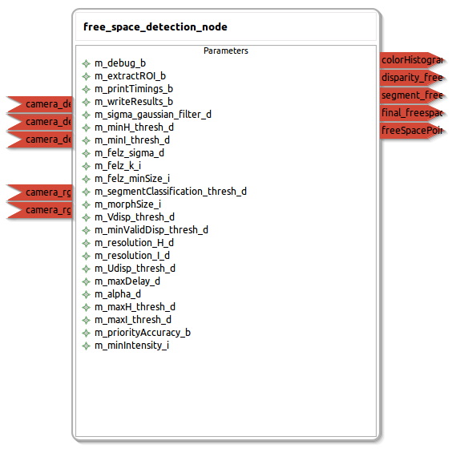

free_space_detection
====================

General description
---------------------
The free_space_detection package

Node: free_space_detection_node
---------------------
#### Parameters
**m_debug_b** *(bool, default: false)*
<!--- protected region m_debug_b on begin -->
Print debug information onto console.
<!--- protected region m_debug_b end -->

**m_extractROI_b** *(bool, default: true)*
<!--- protected region m_extractROI_b on begin -->
Extract lower half of image area as Region of Interest (ROI).
<!--- protected region m_extractROI_b end -->

**m_printTimings_b** *(bool, default: false)*
<!--- protected region m_printTimings_b on begin -->
Print timing information onto console.
<!--- protected region m_printTimings_b end -->

**m_writeResults_b** *(bool, default: false)*
<!--- protected region m_writeResults_b on begin -->
Write result images to PNG-files.
<!--- protected region m_writeResults_b end -->

**m_sigma_gaussian_filter_d** *(double, default: 0.7)*
<!--- protected region m_sigma_gaussian_filter_d on begin -->
Sigma of gaussian filter for noise reduction in color image.
<!--- protected region m_sigma_gaussian_filter_d end -->

**m_minH_thresh_d** *(double, default: 0.3)*
<!--- protected region m_minH_thresh_d on begin -->
Lower boundary for entropy based threshold for hue (H) in H-I-Segmentation.
<!--- protected region m_minH_thresh_d end -->

**m_minI_thresh_d** *(double, default: 0.3)*
<!--- protected region m_minI_thresh_d on begin -->
Lower boundary for entropy based threshold for intensity (I) in H-I-Segmentation.
<!--- protected region m_minI_thresh_d end -->

**m_felz_sigma_d** *(double, default: 0.9)*
<!--- protected region m_felz_sigma_d on begin -->
Sigma parameter for Graph based segmentation of Felzenszwalb and Huttenlocher.
<!--- protected region m_felz_sigma_d end -->

**m_felz_k_i** *(int, default: 200)*
<!--- protected region m_felz_k_i on begin -->
K parameter for Graph based segmentation of Felzenszwalb and Huttenlocher.
<!--- protected region m_felz_k_i end -->

**m_felz_minSize_i** *(int, default: 250)*
<!--- protected region m_felz_minSize_i on begin -->
MinSize parameter for Graph based segmentation of Felzenszwalb and Huttenlocher, minimum size of segments in pixel.
<!--- protected region m_felz_minSize_i end -->

**m_segmentClassification_thresh_d** *(double, default: 0.6)*
<!--- protected region m_segmentClassification_thresh_d on begin -->
Threshold for segment classification: relative amount of free space pixel a region must exceed to be considered as free space.
<!--- protected region m_segmentClassification_thresh_d end -->

**m_morphSize_i** *(int, default: 2)*
<!--- protected region m_morphSize_i on begin -->
Size of morphological operator used if morphological closing is applied.
<!--- protected region m_morphSize_i end -->

**m_Vdisp_thresh_d** *(double, default: 10.0)*
<!--- protected region m_Vdisp_thresh_d on begin -->
Maximum distance (in pixel) for pixel being assigned to line in V disparity image.
<!--- protected region m_Vdisp_thresh_d end -->

**m_minValidDisp_thresh_d** *(double, default: 0.7)*
<!--- protected region m_minValidDisp_thresh_d on begin -->
Minimum relative amount of valid disparities in disparity image for disparity information to be considered as reliable.
<!--- protected region m_minValidDisp_thresh_d end -->

**m_resolution_H_d** *(double, default: 0.05)*
<!--- protected region m_resolution_H_d on begin -->
Resolution of hue (H) histogram.
<!--- protected region m_resolution_H_d end -->

**m_resolution_I_d** *(double, default: 0.03)*
<!--- protected region m_resolution_I_d on begin -->
Resolution of intensity (I) histogram.
<!--- protected region m_resolution_I_d end -->

**m_Udisp_thresh_d** *(double, default: 5.0)*
<!--- protected region m_Udisp_thresh_d on begin -->
Maximum distance (in pixel) for pixel being assigned to line in U disparity image.
<!--- protected region m_Udisp_thresh_d end -->

**m_maxDelay_d** *(double, default: 450.0)*
<!--- protected region m_maxDelay_d on begin -->
Maximum time delay in milliseconds allowed between time stamps of color image and disparity image.
<!--- protected region m_maxDelay_d end -->

**m_alpha_d** *(double, default: 0.7)*
<!--- protected region m_alpha_d on begin -->
Weight for influence of entropy in calculation of entropy based threshold in H-I-Segmentation.
<!--- protected region m_alpha_d end -->

**m_maxH_thresh_d** *(double, default: 0.8)*
<!--- protected region m_maxH_thresh_d on begin -->
Upper boundary for entropy based threshold for hue (H) in H-I-Segmentation.
<!--- protected region m_maxH_thresh_d end -->

**m_maxI_thresh_d** *(double, default: 0.8)*
<!--- protected region m_maxI_thresh_d on begin -->
Upper boundary for entropy based threshold for intensity (I) in H-I-Segmentation.
<!--- protected region m_maxI_thresh_d end -->

**m_priorityAccuracy_b** *(bool, default: true)*
<!--- protected region m_priorityAccuracy_b on begin -->
Perform graph based segmentation. This improves accuracy at object borders but takes much more time.
<!--- protected region m_priorityAccuracy_b end -->

**m_minIntensity_i** *(int, default: 80)*
<!--- protected region m_minIntensity_i on begin -->
Minimum mean intensity value for good image quality.
<!--- protected region m_minIntensity_i end -->

#### Published Topics
**segment_freespace_mask** *(sensor_msgs::Image)*   
<!--- protected region segment_freespace_mask on begin -->
Result free space mask of the graph based segmentation and classification step.
<!--- protected region segment_freespace_mask end -->

**colorHistogram_freespace_mask** *(sensor_msgs::Image)*   
<!--- protected region colorHistogram_freespace_mask on begin -->
Result free space mask of the H-I segmentation step.
<!--- protected region colorHistogram_freespace_mask end -->

**disparity_freespace_mask** *(sensor_msgs::Image)*   
<!--- protected region disparity_freespace_mask on begin -->
Result free space mask of the V disparity step.
<!--- protected region disparity_freespace_mask end -->

**final_freespace_mask** *(sensor_msgs::Image)*   
<!--- protected region final_freespace_mask on begin -->
Result free space mask.
<!--- protected region final_freespace_mask end -->

**freeSpacePoints** *(sensor_msgs::PointCloud2)*   
<!--- protected region freeSpacePoints on begin -->
Free space 3D points based on final free space mask.
<!--- protected region freeSpacePoints end -->

#### Subscribed Topics
**camera_rgb_camera_info** *(sensor_msgs::CameraInfo)*   
<!--- protected region camera_rgb_camera_info on begin -->
Camera information of microsoft kinect RGB camera.
<!--- protected region camera_rgb_camera_info end -->

**camera_rgb_image_color** *(sensor_msgs::Image)*   
<!--- protected region camera_rgb_image_color on begin -->
Color image of microsoft kinect RGB camera.
<!--- protected region camera_rgb_image_color end -->

**camera_depth_disparity** *(stereo_msgs::DisparityImage)*   
<!--- protected region camera_depth_disparity on begin -->
Disparity image of microsoft kinect IR (depth) camera.
<!--- protected region camera_depth_disparity end -->

**camera_depth_points** *(sensor_msgs::PointCloud2)*   
<!--- protected region camera_depth_points on begin -->
3D PointCloud of microsoft kinect IR (depth) camera.
<!--- protected region camera_depth_points end -->

**camera_depth_camera_info** *(sensor_msgs::CameraInfo)*   
<!--- protected region camera_depth_camera_info on begin -->
Camera information of microsoft kinect IR (depth) camera.
<!--- protected region camera_depth_camera_info end -->

